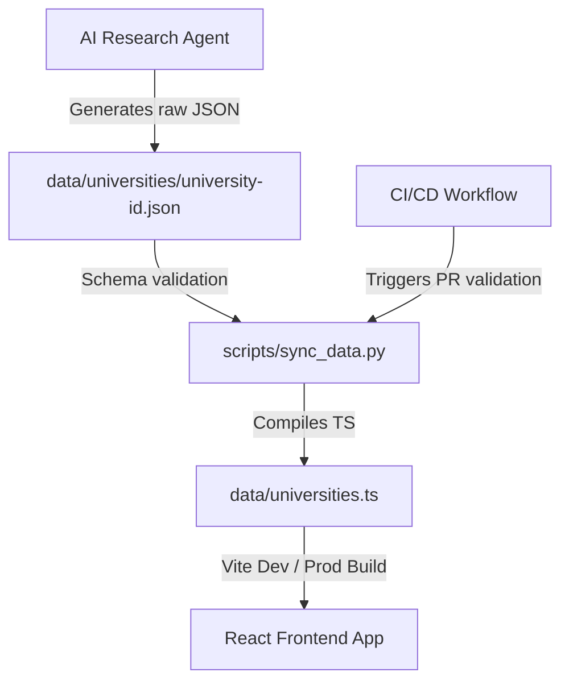

# GradNiche AI-Agent Automation Architecture Documentation

Welcome to the **GradNiche Agent Automation** system! This document explains the new scalable architecture designed to support automated university research, SEO generation, blog creation, data correction, and PR-based safe publishing.

---

## 1. System Overview

To grow GradNiche to thousands of global universities and blog posts without introducing manual content management overhead, we have restructured the repository for **AI-agent autonomy**.

The core philosophy of this architecture is **Data-Driven Separation**:
* **Agents & Prompts** are isolated from code, allowing AI prompt engineering and automation scripting without modifying React components.
* **Content Datasets** are stored in raw, clean, structured JSON schemas.
* **Synchronization Pipelines** dynamically compile these raw JSON assets into standard TypeScript modules (`data/universities.ts`) during pre-build. This guarantees that your existing React frontend works seamlessly without any architectural changes or heavy bundling overhead!



---

## 2. Directory Layout & Organization

The repository restructuring introduces the following directories:

```
/ (Workspace Root)
├── agents/                     # AI Automation Scripts & Agent Logic
│   └── research_agent.py       # Python script implementing research loops
├── data/                       # Structured Content Datasets
│   ├── schema/                 # Formal JSON validation schemas
│   │   ├── university-schema.json
│   │   └── sample-university.json
│   ├── universities/           # Raw JSON files for each university
│   │   └── boston-university.json
│   └── blogs/                  # Raw JSON/Markdown blog files
├── prompts/                    # Version-Controlled Agent System Prompts
│   ├── university_research.txt # Prompt for crawling & data extraction
│   ├── seo_generation.txt      # Prompt for automated page meta tags
│   ├── blog_generation.txt     # Prompt for high-quality article writing
│   └── content_correction.txt  # Self-correction check for generated data
├── workflows/                  # CI/CD Workflows for AI publishing
│   ├── ai-publish.yml          # GitHub Action for Schedule/Dispatch PR creation
│   └── validate-data.yml       # PR validation rules
└── scripts/                    # Build, Sync, and Validator Bridges
    └── sync_data.py            # Converts JSON profiles to universities.ts
```

---

## 3. Dynamic Page Generation from Structured Data

The frontend is already configured with client-side dynamic routing under `App.tsx` (using History API):
* `/college-finder` lists all universities in the compiled `universities` array.
* `/college-finder/:universityId` displays the dynamic profile for a specific university.
* `/college-finder/:universityId/:programId` displays specific graduate degree program details.

### Scaling Strategy (Build-Time Synchronization)
Instead of hardcoding a massive `universities.ts` file or fetching thousands of individual APIs at runtime, we utilize a **Build-Time Synchronization Bridge**:
1. **Pre-Build Command**: Before launching the dev server or compiling the build, `npm run dev` or `npm run build` will trigger our bridge:
   ```bash
   python scripts/sync_data.py --production
   ```
2. **Dynamic TypeScript Compilation**: The bridge automatically reads every single JSON file under `data/universities/`, validates them against `data/schema/university-schema.json` to catch syntax or schema errors, and compiles them into a unified TypeScript array in `data/universities.ts`.
3. **No Bundle Bloat**: When scaling to thousands of universities, we can easily change this script to output individual chunked JSONs under the `/public/data/` folder and fetch them dynamically in `App.tsx` on-demand, without changing any of our layout components!

---

## 4. Safe GitHub PR-Based Publishing Workflow

To prevent AI agents from accidentally introducing bugs or breaking the website, **agents are never allowed to write directly to the `main` branch**. 

We have implemented a **Secure Pull Request Workflow**:

1. **AI Launch**: A weekly GitHub Action schedule or a manual trigger (dispatch) starts the AI Research Agent (`agents/research_agent.py`).
2. **Branch Creation**: The workflow checks out a new branch: `ai/update-university-[timestamp]`.
3. **Research & Sync**: The research agent generates a new university JSON profile and saves it. The synchronizer (`sync_data.py --production`) compiles it.
4. **Local Verification**: The Action automatically validates the JSON data against the official JSON Schema.
5. **Pull Request Opening**: If changes are detected and all tests pass, the action commits the files and uses the GitHub CLI to open a **Pull Request (PR)** to `main`.
6. **Human Review & Merge**: A human admin reviews the generated profile, comments, or suggests modifications. Merging the PR triggers the Netlify deployment!

---

## 5. Netlify + GitHub + AI Agent Production Setup

Here is the best practice deployment pipeline for GradNiche:

```
                  ┌───────────────────────────────┐
                  │   GitHub Schedule/Trigger     │
                  └───────────────┬───────────────┘
                                  │
                                  ▼
                  ┌───────────────────────────────┐
                  │   AI Agent creates branch &   │
                  │   opens Pull Request on GH    │
                  └───────────────┬───────────────┘
                                  │
                                  ▼
                  ┌───────────────────────────────┐
                  │    Netlify Deploy Preview     │
                  │  (Tests visual site changes)  │
                  └───────────────┬───────────────┘
                                  │
                                  ▼
                     [ HUMAN ADMIN REVIEWS PR ]
                                  │
                                  ▼
                  ┌───────────────────────────────┐
                  │       Merge PR to 'main'      │
                  └───────────────┬───────────────┘
                                  │
                                  ▼
                  ┌───────────────────────────────┐
                  │  Netlify Production Deploy    │
                  │      (Site goes Live!)        │
                  └───────────────────────────────┘
```

### Steps to set up:
1. **GitHub Secrets**: Add a secret named `GEMINI_API_KEY` to your GitHub Repository Settings (under *Settings > Secrets and Variables > Actions*). This key is used by the `google-genai` SDK in GitHub Actions.
2. **Netlify Site Link**: Connect your GitHub repository to your Netlify site.
3. **Build Settings in Netlify**:
   - **Build Command**: `python scripts/sync_data.py --production && npm run build` (Note: Ensure Python is available in your Netlify build environment, or configure it during pre-build. If Python is not available on Netlify, you can check in the compiled `data/universities.ts` file directly in the PR, since the AI agent pushes it to the branch).
   - **Publish Directory**: `dist` (or `build` depending on your Vite output folder).
4. **Deploy Previews**: Netlify automatically generates a unique web preview link for every AI Pull Request. You can click this link to visually test the entire site and see the new university page live before approving the merge!

---

## 6. How to Run & Verify locally (Phase 1)

### To dry-run data compilation:
Run the bridge script directly from the workspace root. It will compile your JSON files into a safe `data/universities_compiled.ts` file without altering your existing production `data/universities.ts` file:
```bash
python scripts/sync_data.py
```

### To apply and compile for production:
Run with the `--production` flag. This will compile all your raw JSONs directly into the production `data/universities.ts` file:
```bash
python scripts/sync_data.py --production
```
*(In Phase 2, you can add `"prebuild": "python scripts/sync_data.py --production"` to your `package.json` scripts to automate this every time you run `npm run dev` or `npm run build`).*
